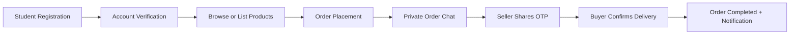
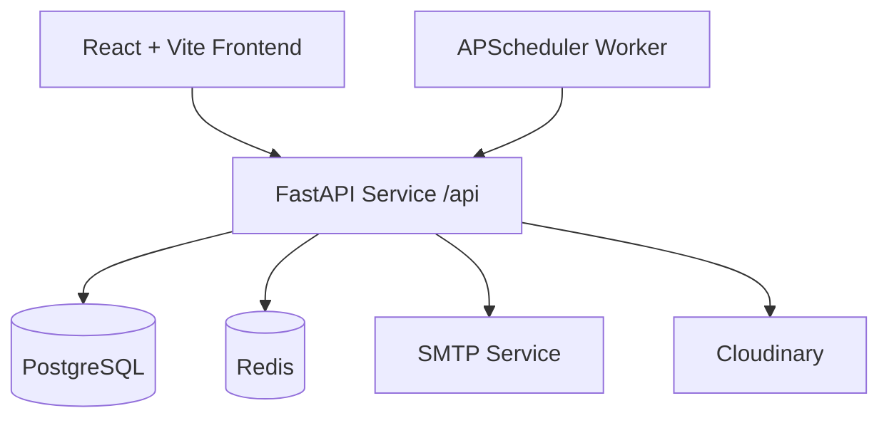

# UNIMART // VERIFIED CAMPUS MARKETPLACE

<div align="center">
  

  <p>
    
  </p>

  <p>
    
    
    
    
    
  </p>
</div>

UNIMART is a production-style campus commerce platform where verified students can list products, place orders, communicate inside private order chat, and close delivery with OTP confirmation.

## Why This Project Stands Out

- Student verification-first access model.
- Strict order lifecycle with role-safe status transitions.
- Private buyer/seller communication channels linked to each order.
- OTP handoff confirmation to reduce fake delivery claims.
- Admin governance tools for oversight and moderation.

## End-to-End Flow



## Platform Architecture



## API Domains

| Domain | Route Prefix | Responsibility |
|---|---|---|
| Authentication | /api/auth | Register, login, token management |
| Products | /api/products | Create, list, search, update product records |
| Orders | /api/orders | Buyer purchase flow and status lifecycle |
| Chat | /api/chat | Order-scoped communication |
| OTP | /api/otp | Secure handoff verification |
| Notifications | /api/notifications | User event updates |
| Upload | /api/upload | Product media uploads |
| Admin | /api/admin | Moderation and admin operations |

## Tech Stack

- Frontend: React 18, Vite, Tailwind CSS, Framer Motion, Axios, React Router.
- Backend: FastAPI, SQLAlchemy, Alembic, APScheduler.
- Storage and messaging: PostgreSQL, Redis.
- Integrations: SMTP mail service, Cloudinary media hosting.
- Developer workflow: GitHub Actions + local build and import checks.

## Project Layout

```text
.
|- backend/
|  |- routers/
|  |- services/
|  |- middleware/
|  |- alembic/
|  \- .env.example
|- frontend/
|  |- src/
|  |- public/
|  \- .env.example
|- docs/
|  \- local-development-guide.md
|- .github/workflows/
\- README.md
```

## Local Setup

### 1. Backend

```powershell
cd backend
python -m venv .venv
.\.venv\Scripts\Activate
pip install -r requirements.txt
copy .env.example .env
alembic upgrade head
uvicorn main:app --host 0.0.0.0 --port 8000 --reload
```

### 2. Frontend

```powershell
cd frontend
npm install
copy .env.example .env.local
npm run dev
```

### 3. Local URLs

- Frontend: http://localhost:5173
- Backend API: http://localhost:8000/api
- Swagger Docs: http://localhost:8000/docs
- Health Endpoint: http://localhost:8000/api/health

## Environment Contract

Backend core variables:

- DATABASE_URL
- DB_ADMIN_USER, DB_ADMIN_PASSWORD, DB_HOST, DB_PORT, DB_NAME
- REDIS_URL
- SECRET_KEY, ALGORITHM, ACCESS_TOKEN_EXPIRE_MINUTES
- REFRESH_TOKEN_SECRET
- ADMIN_JWT_SECRET, ADMIN_USERNAME, ADMIN_PASSWORD, ADMIN_DISPLAY_NAME
- SMTP_SERVER, SMTP_PORT, SMTP_EMAIL, SMTP_PASSWORD
- CLOUDINARY_CLOUD_NAME, CLOUDINARY_API_KEY, CLOUDINARY_API_SECRET
- APP_ENV, ENVIRONMENT, LOG_LEVEL, ENABLE_SCHEDULER
- CORS_ORIGINS
- OFFICIAL_RECORDS_CSV

Frontend variables:

- VITE_API_URL
- VITE_APP_BASENAME

## Sensitive Data Policy

- `backend/official_data.csv` is treated as local/private dataset input.
- The file is ignored by Git and removed from tracking to prevent accidental push of official records.
- Use `OFFICIAL_RECORDS_CSV` in backend `.env` to point to your local dataset path (relative or absolute).

## Quality Checks Run

- Backend syntax/import check completed by Python compile/import smoke validation.
- Frontend production build completed successfully.
- Result: project compiles and starts, with one non-blocking Vite chunk-size warning for bundle optimization.

## License

Apache License 2.0
